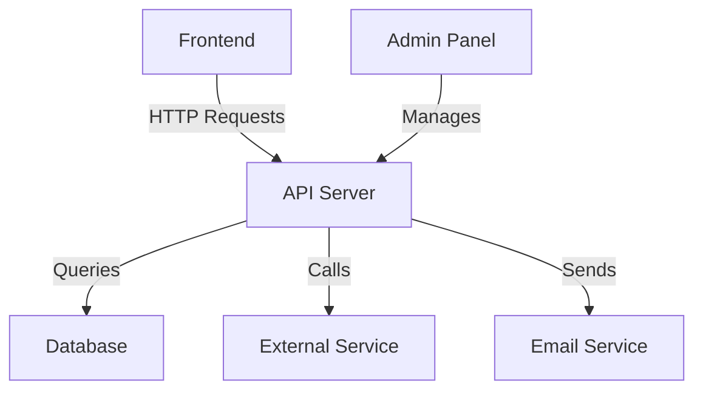

# Documenting Proprietary Systems

Welcome to the final developer module! This one is about something every developer hates doing but everyone needs: **documentation**.

**Here's the truth:** You built an amazing internal tool. It works perfectly. But if you get hit by a bus (or just take a holiday), nobody knows how it works. Documentation prevents this 'bus factor' problem.

**The good news:** AI can write most of the documentation for you. You just need to review and refine it.


*'You: I should document this. Also you: But I don't have time. AI: I'll write it, you just review it.'*

## Learning Objectives

By the end of this module, you'll be able to:

- Generate 'How-to' guides for internal tools automatically
- Keep documentation in sync with code changes using AI
- Create architectural diagrams from codebases
- Onboard new developers to proprietary systems quickly
- Understand why documentation doesn't have to be painful

---

## The "Bus Factor" Problem (Why Documentation Matters)

Let's talk about a real problem in software development.

### What is the Bus Factor?

**The Bus Factor** = The number of people who need to get hit by a bus before your project is in trouble.

**Example:**
- You built a custom internal tool
- It's great and everyone uses it
- But you're the only one who knows how it works
- Bus Factor = 1 (if you leave, the tool dies)

**The problem:**
- You go on holiday → Tool breaks → Nobody can fix it
- You leave the company → Tool becomes unusable
- You get sick → Project is blocked

**The solution:**
Good documentation means other people can understand and maintain your tools.


*'The Bus Factor: How many people need to disappear before your project dies?'*

### Why Proprietary Systems Need Documentation Most

**Proprietary systems** = Custom tools built specifically for your company. They're not like commercial software with public documentation.

**Why they're vulnerable:**
- No public documentation exists
- Only a few people understand them
- They're often built quickly without docs
- When the builder leaves, knowledge leaves with them

**The reality:**
Proprietary systems *die* without documentation. They become 'black boxes' that nobody dares to touch.

---

## Technique 1: Code-to-Docs Pipeline (Automatic READMEs)

Don't write README files manually. Let AI do it!

### The Old Way (Why It's Painful)

**Traditional approach:**
- Write README from scratch
- Try to remember what the code does
- Forget important details
- Documentation gets outdated quickly
- Nobody reads it anyway

**The problem:** Writing docs is boring, and they get outdated fast.

### The New Way (Using AI)

**Step 1:** Select the core logic files from your tool

**Step 2:** Ask AI:
> "Read this code. Write a `README.md` that explains:
> - What this tool does
> - How to install it
> - The main architecture
> - Common troubleshooting steps
> - How to contribute or modify it"

**Step 3:** Review the generated README
- Is it accurate?
- Does it cover everything?
- Is it clear for someone new?

**Step 4:** Refine it
- Add screenshots if needed
- Add examples
- Update any sections that aren't clear

**What this saves:** Hours of writing, and the docs are based on actual code (so they're more accurate!)


### Example: Documenting a Data Processing Tool

**Your code:** A Python script that processes CSV files and generates reports

**AI-generated README:**
```markdown
# Data Processing Tool

## What It Does

This tool processes CSV files containing sales data and generates monthly reports with statistics and visualisations.

## Installation

1. Install Python 3.8+
2. Install dependencies: `pip install -r requirements.txt`
3. Configure settings in `config.json`

## Architecture

- `main.py`: Entry point, handles file processing
- `processors.py`: Contains data processing logic
- `reporters.py`: Generates report outputs
- `utils.py`: Helper functions

## Usage

```bash
python main.py input.csv output/
```

## Troubleshooting

- **Error: File not found**: Check file path is correct
- **Error: Invalid CSV format**: Ensure CSV has required columns
- **Slow performance**: Large files may take several minutes
```

**See?** AI wrote a complete README based on your code!

---

## Technique 2: The "User Guide" Generator (For Non-Developers)

Developers write documentation for developers. But what if your users aren't developers?

### The Problem

**Technical documentation:**
- Full of jargon
- Assumes programming knowledge
- Focuses on 'how it works' not 'how to use it'
- Scares non-technical users

**User guides:**
- Written in plain English
- Focus on 'how to use it'
- Step-by-step instructions
- Screenshots and examples

### How AI Helps

**Step 1:** Get your technical documentation (or code)

**Step 2:** Ask AI:
> "I am a Project Manager, not a coder. Read this technical documentation. Rewrite it as a 'User Guide' for me. Focus on *how to use it*, not *how it works*. Use step-by-step lists and include placeholders for screenshots."

**Step 3:** Review and add actual screenshots

**What you get:** Documentation that non-technical team members can actually use!


### Example: User Guide vs Technical Docs

**Technical documentation:**
> "The system exposes a REST API endpoint at `/api/users` that accepts POST requests with JSON payloads containing user data. Authentication is handled via JWT tokens in the Authorization header."

**AI-generated user guide:**
> "## How to Add a New User
> 
> 1. Log into the system (you'll need your username and password)
> 2. Click the 'Users' button in the top menu
> 3. Click 'Add New User' (green button on the right)
> 4. Fill in the form:
>    - Name: Enter the user's full name
>    - Email: Enter their email address
>    - Role: Select from the dropdown (Admin, User, or Viewer)
> 5. Click 'Save'
> 6. You'll see a success message confirming the user was added
> 
> **Troubleshooting:** If you get an error, make sure the email isn't already in use."

**Much better for non-technical users!**

---

## Technique 3: Architectural Diagrams (Visualising Your System)

Sometimes you need to see how everything fits together. Diagrams help!

### Why Diagrams Matter

**Text documentation:**
- "The frontend sends requests to the API, which queries the database..."
- Hard to visualise
- Easy to get lost in details

**Diagrams:**
- Visual representation
- Easy to understand at a glance
- Shows relationships clearly

### How to Generate Diagrams with AI

**Step 1:** Paste your folder structure or core class definitions

**Step 2:** Ask AI:
> "Generate a Mermaid.js diagram that visualises the data flow of this application. Show how the Frontend talks to the API and the Database. Include the main components."

**Step 3:** Copy the Mermaid code into [Mermaid Live Editor](https://mermaid.live/) to see the diagram

**Step 4:** Add it to your documentation!

### Example: System Architecture Diagram

**AI-generated Mermaid code:**


**This shows:** How all the pieces connect. Much clearer than paragraphs of text!


---

## Your Practice Exercise: Document a Legacy Tool

Ready to document something? Let's practice on a real tool (or make one up).

### Step 1: Choose Your Tool

Pick a script or tool you wrote (or find one in your codebase):
- A data processing script
- An internal dashboard
- A deployment tool
- A reporting system

**Don't have one?** That's okay! Use this example: A script that backs up files to cloud storage.

### Step 2: Generate a Diagram

**Ask AI:**
> "Generate a Mermaid.js diagram showing how this tool works. Include the main steps and data flow."

**Copy the code** into Mermaid Live Editor to see your diagram!

### Step 3: Generate a Quick Start Guide

**Ask AI:**
> "Read this code/tool. Write a 'Quick Start Guide' for a new team member. Include:
> - What it does (one sentence)
> - How to set it up (step-by-step)
> - How to use it (basic usage)
> - Common issues and how to fix them"

### Step 4: Generate an FAQ

**Ask AI:**
> "Based on this code's complexity, generate 5 'Frequently Asked Questions' that new users might have. Include the answers."

**Example questions AI might generate:**
- "What happens if the tool fails mid-process?"
- "Can I run this on multiple files at once?"
- "How do I change the output location?"
- "What file formats are supported?"
- "How long does it usually take to run?"

### Step 5: Create a User Guide

**Ask AI:**
> "Rewrite this technical documentation as a user guide for non-technical team members. Use simple language and step-by-step instructions."

### Questions to Reflect On

- Did AI understand your code better than you remembered it?
- Is the User Guide actually usable by non-developers?
- How easy would it be to update this documentation when the code changes?
- Would a new team member be able to use your tool with this documentation?


---

## Keeping Documentation Updated (The Ongoing Challenge)

Documentation gets outdated. Here's how to keep it fresh.

### The Problem

- Code changes
- Documentation doesn't
- Soon they don't match
- Documentation becomes useless

### The Solution: Update with AI

**When code changes:**
1. Show AI the updated code
2. Ask: "Update this README to match the current code. Highlight what changed."
3. Review and merge

**Regular maintenance:**
- Set a reminder to review docs quarterly
- Use AI to check if docs match code
- Update diagrams when architecture changes

**Pro tip:** Some teams include 'update docs' as part of their code review process!


---

## Next Steps

Congratulations! You've completed the entire Developer Track! 🎉

You've learned:
1. ✅ AI fundamentals for developers
2. ✅ Building automated research tools
3. ✅ Testing efficiently with AI
4. ✅ Refactoring legacy code
5. ✅ Documenting proprietary systems

**Your code is now:** Clean, tested, documented, and maintainable. That's impressive!

**What's next?** Keep practising these skills. The more you use them, the more natural they become. You're now equipped to work efficiently with AI as your coding assistant!

---

## Resources

- [Mermaid.js Live Editor](https://mermaid.live/) - Create diagrams easily
- [Diataxis Framework](https://diataxis.fr/) - A framework for documentation structure
- [TBS Documentation Standards](https://tbs.digital/docs) - Internal documentation guidelines

---

## Module Checklist

Before completing the Developer Track:

- [ ] Read through all the content
- [ ] Generated documentation for at least one tool
- [ ] Created an architectural diagram
- [ ] Written a user guide for non-technical users
- [ ] Understood the importance of keeping docs updated

**Estimated Time:** 45 minutes (longer if you're doing the exercises)

**Difficulty:** Intermediate (but we've made it simple!)

**You've Mastered the Developer Track!** 🚀🎓

**Remember:** Good documentation is a gift to your future self (and your team). You'll thank yourself later!
